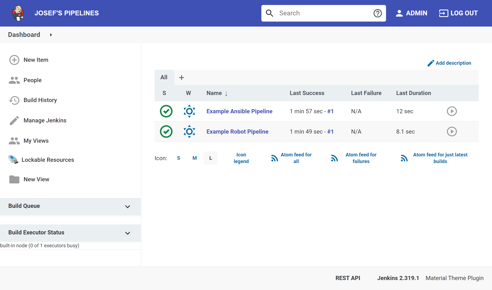

# Josef Pipe (A Pipeline Boilerplate)

Pipeline development boilerplate with easy deployment in mind with pre-configured Ansible and Robot Framework on top of Jenkins.  




## Motivation

This project aims to be a boilerplate to ship Jenkins platform to an on-premise environment with pre-configured and pre-installed pipelines using Docker.     

**Where does the name come from?**

It was inspired by the name of a PVC pipe brand (Fırat Boru), which is quite viral in Turkey.

You can watch the viral ad from the link below; 

[](https://www.youtube.com/watch?v=qIAKrF_PhuI)

## Requirements

- Docker

## Usage

Clone the repository;

```
git clone https://github.com/yusufcanb/josefpen
```

Build and run using Docker

```
docker build -t josefpen . && docker run -p 8080:8080 josefpen 
```

Finally, navigate to [http://localhost:8080](http://localhost:8080), you should see the login page. The default username and password is `admin/admin`.

## Development


- `/ansible` directory contains ansible resources and `requirements.txt` for requirements.
- `/robots` directory contains robot framework resources and `requirements.txt` for requirements.
- `/dsl` directory contains Groovy scripts to define pipelines.
- `/jenkins/casc.yaml` file is the Jenkins Configuration as Code which you can define your Groovy scripts like below;
    ```yaml
    jobs:
      - file: /opt/deploy/dsl/ansible.groovy
      - file: /opt/deploy/dsl/rf.groovy
    ```
